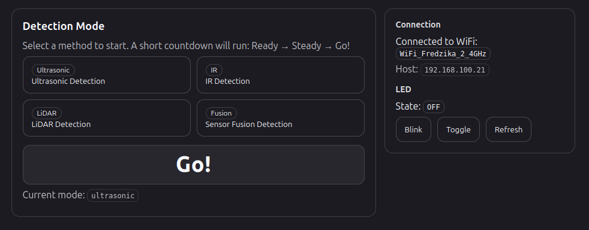

# Communication Protocol:

## ESP32 as master:
IR: #M:I;
Ultrasonic: #M:U;
LiDAR: #M:L;
Fusion: #M:F;

## STM32 as master:

time_ms = uint number;

IR: #M:I,time_ms;
Ultrasonic: #M:U,time_ms;
LiDAR: #M:L,time_ms;
Fusion: #M:F,time_ms;

## UI:
