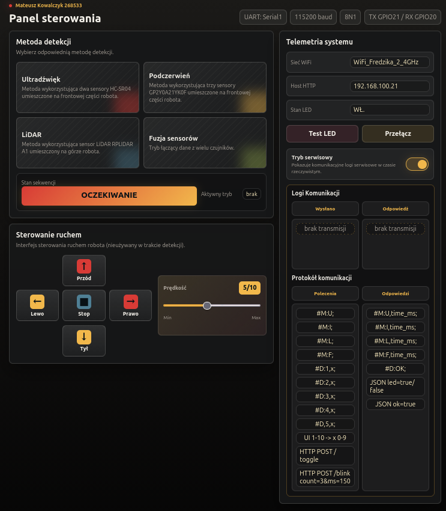

# Communication Protocol:

## ESP32 as master:

`Methodes:` 

- IR: #M:I;
- Ultrasonic: #M:U;
- LiDAR: #M:L;
- Fusion: #M:F;

`Motion:`

- Front: #D:1,x;
- Back:  #D:2,x;
- Right: #D:3,x;
- Left:  #D:4,x; 
- Stop:  #D,5,x;

x - number 0-9. 

0 = min speed, 9 = max speed.

## STM32 as slave (responses):

`Argument:`

- time_us = uint number;

`Methodes:`
- IR: #M:I,time_us;
- Ultrasonic: #M:U,time_us;
- LiDAR: #M:L,time_us;
- Fusion: #M:F,time_us;

`Motion:`
- #D:OK;

## UI:

## UI in service mode:
